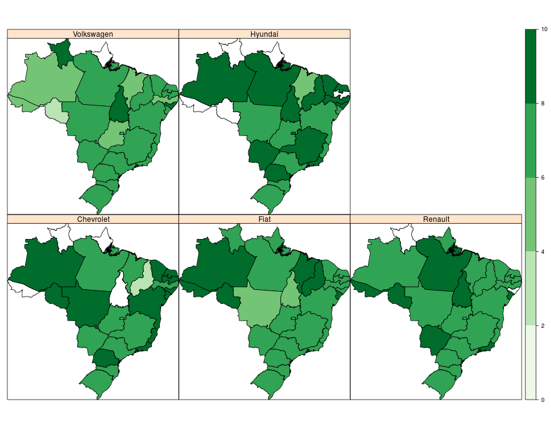
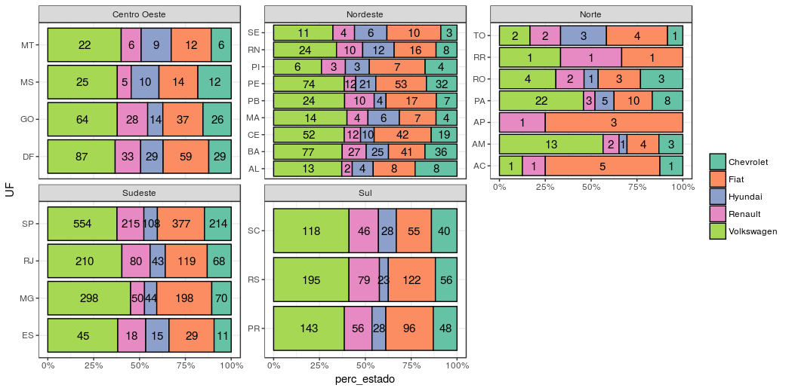
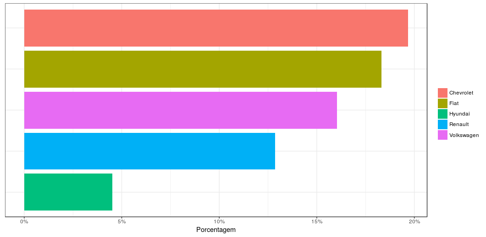
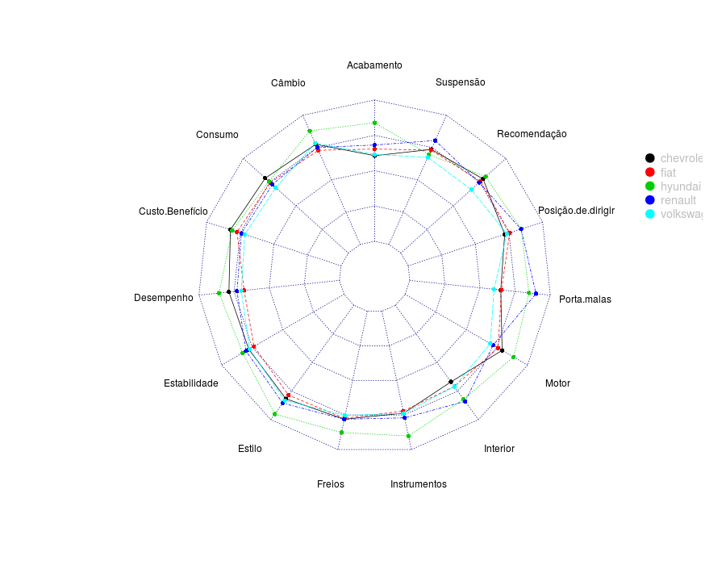

```{r, echo = FALSE}
library(knitr)
opts_chunk$set(
               echo = FALSE, 
               cache = FALSE,
               fig.align = "center"
           )
```

# Objetivo

* Diferença entre marcas por estados

* Fidelidade da marca

* Identificar **diferenças** entre as marcas por
quesito.

# Distribuição Espacial no quesito Recomendação

```{r}

```

# Preferência entre Estados

```{r}

```

# Fidelidades das Marcas

```{r}

```

# Notas

# Médias dos Quesitos por Marcas

```{r}

```

# Diferença Entre as Marcas

```{r, hide = TRUE}
model <- readRDS("summary.RData")
```
# Custo-Benefício

```{r}
model$`Resp.Variable 3`
```

# Consumo

```{r}
model$`Resp.Variable 4`
```

# Recomendação

```{r}
model$`Resp.Variable 9`
```

# Correlação

```{r}
head(model$Correlation)
```


